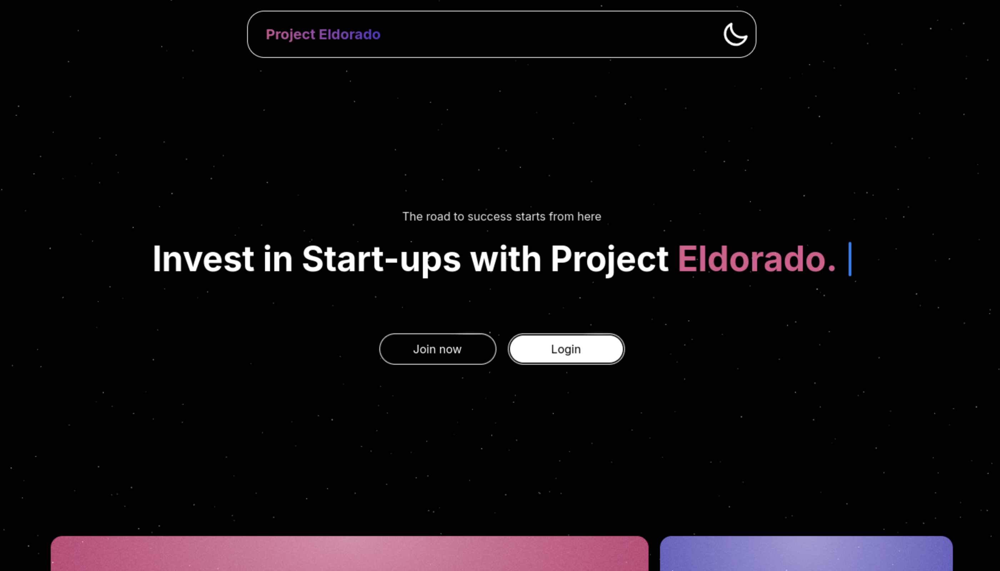
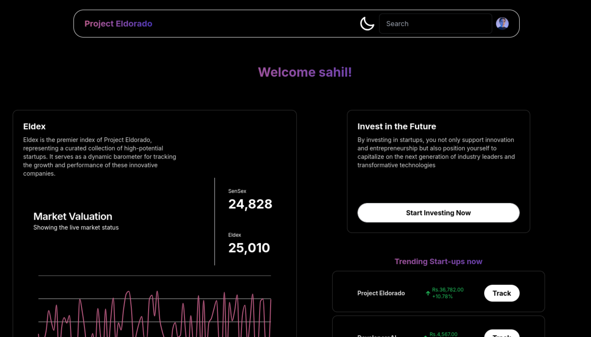
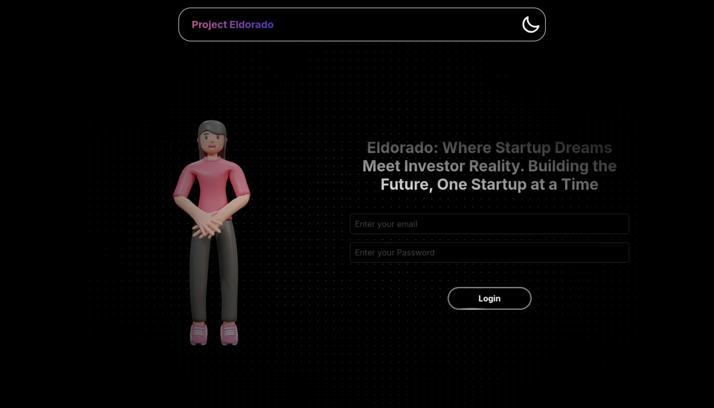
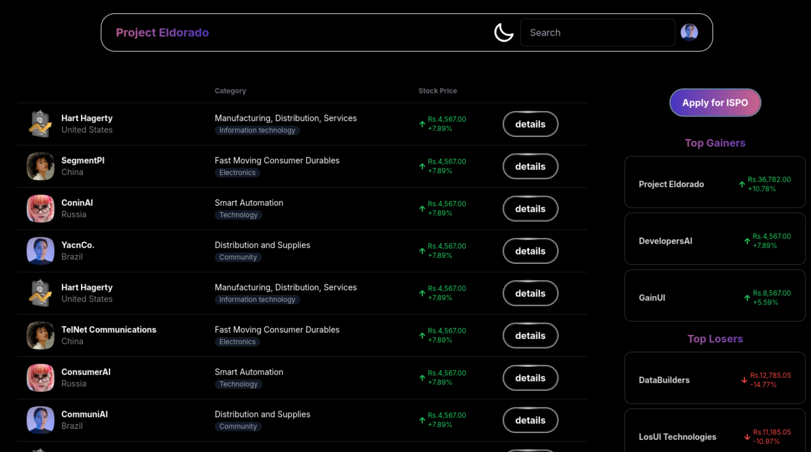

# Project Eldorado
Project Eldorado is an innovative investment platform that allows you to invest in early-stage startups and earn dividends and profits. We're not just offering you a stake in a startup; we're offering a stake in the future.

---
### Features

- Login and Signup: Our user-friendly interface makes it easy for anyone to join. Whether you're a seasoned investor or a first-timer, our platform is designed for you.

- Market Tracking: Keep your finger on the pulse of the startup ecosystem with real-time market data. Know when to hold 'em and when to fold 'em!

- Eldex: Think of it as the Sensex, but for startups. Eldex is our proprietary index, tracking the top 40 startups based on valuation. It's your go-to for a snapshot of the market's health.

- Popular Startups: We highlight trending startups so you can catch the next big wave. Remember when Airbnb was just a place to rent air mattresses? We do!

- Startup Price Charts: Each startup comes with its own price chart, detailing the highs, lows, opens, and closes. You can buy and sell shares just like on a stock exchange.

- ISPO - Initial Startup Public Offering: Similar to IPOs or ICOs, our ISPOs allow you to bid on shares before they hit the market. It's like being a venture capitalist but without the yacht—yet!

---

### Hwo to Run

The dependencies of the project include:
- [Next.js](https://nextjs.org/)
- [Node.js](https://nodejs.org/en/download/) (v14.x or later)
- [npm](https://www.npmjs.com/get-npm) or [yarn](https://yarnpkg.com/getting-started/install)
- [Git](https://git-scm.com/book/en/v2/Getting-Started-Installing-Git)

The steps to set up the project are as follows:
- Clone the repository
- Run the following commands

```bash
npm install
npm run build
npm start
```

Alterantively, It can be started on a development server using:
```bash
npm run dev
```

---

### Screenshots









